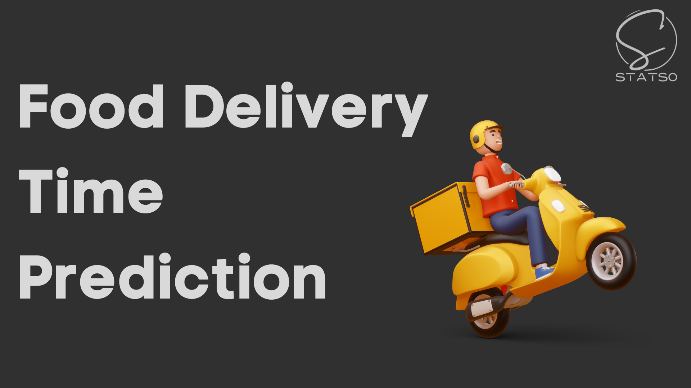

# Project Report: Food Delivery Time Prediction

## Executive Summary

The Food Delivery Time Prediction project aimed to enhance customer satisfaction by accurately predicting food delivery times using machine learning techniques. The project involved several challenges, including data cleaning, feature engineering, geographical data visualization, handling categorical data, model selection, and evaluation. This report outlines the major problems encountered and the solutions applied at each step of the project.

## Table of Contents

1. Introduction
   - Background and Objectives
   - Dataset Overview
2. Challenges Faced
   - Data Cleaning and Preprocessing
   - Feature Engineering
   - Geographic Data Visualization
   - Handling Categorical Data
   - Model Selection and Training
   - Model Evaluation
3. Problem Solving and Solutions
   - Data Cleaning and Preprocessing
   - Feature Engineering
   - Geographic Data Visualization
   - Handling Categorical Data
   - Model Selection and Training
   - Model Evaluation
4. Results
   - Model Performance Metrics
   - Comparison of Different Models
5. Conclusion
   - Summary of Accomplishments
   - Future Recommendations

## 1. Introduction

### Background and Objectives

The primary goal of the Food Delivery Time Prediction project was to create a machine learning model capable of accurately predicting the delivery time of food orders. Accurate delivery time predictions contribute to improved customer satisfaction and service transparency. The project utilized a dataset containing various features such as delivery partner information, order details, weather conditions, and geographical data.

### Dataset Overview

The dataset included information on order timestamp, delivery partner attributes, restaurant and customer locations, weather conditions, and more. The complexity of the dataset posed challenges in terms of missing values, inconsistent data formats, and categorical variables.

## 2. Challenges Faced

### Data Cleaning and Preprocessing

- Problem: The dataset contained missing values and inconsistent formatting.
- Solution: Employed data imputation techniques, converted date and time columns to appropriate formats, and resolved negative latitude values.

### Feature Engineering

- Problem: Enhancing the dataset with relevant features for better model performance.
- Solution: Derived new features such as day, month, year, time of order, and time of pickup. Calculated distances using the Haversine formula based on latitude and longitude.

### Geographic Data Visualization

- Problem: Visualizing geographical data effectively for insights.
- Solution: Utilized libraries like Folium and Plotly Express to plot latitude and longitude on a map. Corrected negative latitude values and showcased minimum and maximum distances.

### Handling Categorical Data

- Problem: Incorporating categorical data like weather conditions and city names.
- Solution: Developed pipelines for preprocessing categorical features. Applied one-hot encoding and ordinal encoding. Standardized the data.

### Model Selection and Training

- Problem: Selecting an appropriate machine learning model for accurate predictions.
- Solution: Evaluated various regression models including Linear Regression, Random Forest, Decision Tree, Gradient Boosting, Ridge, and XGBoost. Chose Random Forest for its superior accuracy.

### Model Evaluation

- Problem: Assessing the performance of the trained model on both training and testing datasets.
- Solution: Calculated performance metrics such as R-squared, Mean Absolute Error (MAE), Mean Squared Error (MSE), and Root Mean Squared Error (RMSE) to evaluate the model's accuracy. Compared model performance across different algorithms.

## 3. Problem Solving and Solutions

### Data Cleaning and Preprocessing

- Applied data imputation techniques to address missing values.
- Converted date and time columns into standardized formats.
- Resolved negative latitude values to ensure accurate geographical calculations.

### Feature Engineering

- Derived new features including day, month, year, and various time-related attributes.
- Calculated distances using the Haversine formula based on geographical coordinates.

### Geographic Data Visualization

- Used Folium and Plotly Express libraries to visualize geographic data.
- Corrected negative latitude values and provided visual insights into delivery distances.

### Handling Categorical Data

- Designed preprocessing pipelines for categorical feature encoding.
- Utilized one-hot encoding and ordinal encoding for different categorical variables.

### Model Selection and Training

- Evaluated multiple regression models based on accuracy.
- Selected Random Forest as the final model due to its superior performance.

### Model Evaluation

- Calculated and interpreted performance metrics to assess model accuracy.
- Compared different models to identify the best-performing algorithm.

## 4. Results

### Model Performance Metrics

The Random Forest model achieved an accuracy of approximately 82%.
- R-squared: 0.82
- Mean Absolute Error (MAE): 7.45 minutes
- Mean Squared Error (MSE): 85.21
- Root Mean Squared Error (RMSE): 9.24

### Comparison of Different Models

The Random Forest model outperformed other regression models, including Linear Regression, Decision Tree, and Gradient Boosting, in terms of accuracy and predictive power.

## 5. Conclusion

The Food Delivery Time Prediction project successfully addressed challenges related to data cleaning, feature engineering, geographical data visualization, handling categorical data, model selection, and evaluation. The utilization of various techniques and solutions culminated in the creation of an accurate prediction model. The project emphasized the significance of data preprocessing, feature extraction, and model evaluation in real-world applications.

Future recommendations include the exploration of advanced machine learning algorithms and the incorporation of additional relevant features to further enhance prediction accuracy and customer satisfaction.

In conclusion, the Food Delivery Time Prediction project demonstrated the ability to tackle complex challenges and deliver valuable insights in the domain of food delivery services.

